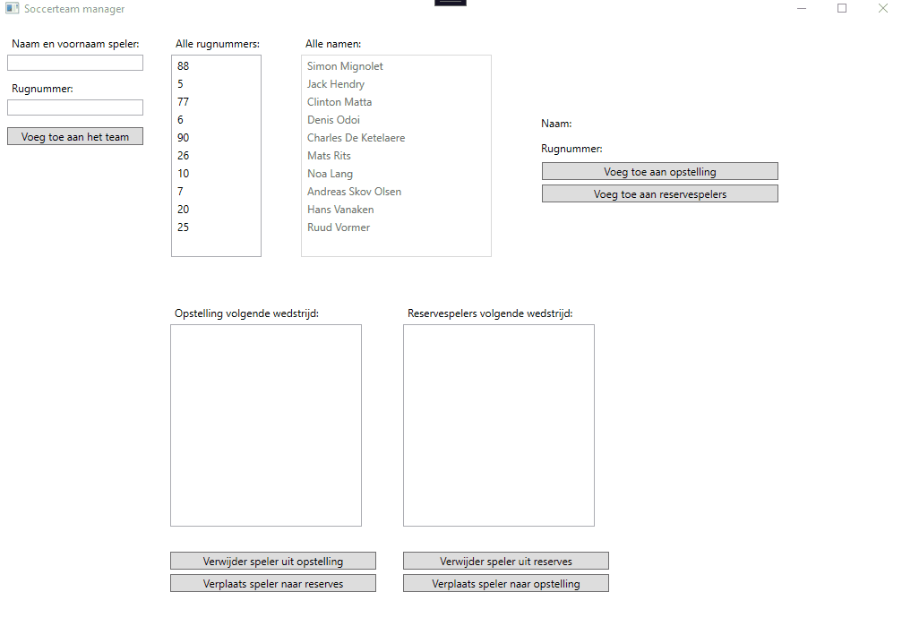

# Oefening Dictionaries - Soccerteam manager
In deze oefening gaan we aan de slag met dictionaries. Volgende topics komen aan bod;

- Dictionaries declareren en initializeren
- Een key en een value toevoegen aan een dictionary
- Een value uitlezen aan de hand van een key in een dictionary
- Alle keys en values uitlezen uit een dictionary
- Dictionary gebruiken als brondata voor een listbox
- Herhaling op variabelen
- Herhaling op methodes
- Herhaling op selecties

## Opdracht
Een belangrijk kenmerk van een dictionary is dat de key uniek moet zijn, deze mag dus binnen éénzelfde dictionary slecht éénmaal voorkomen als key. Bij een voetbalploeg zijn de rugnummers uniek, deze gaan we dus als key gebruiken. De value wordt dan de naam van speler die speelt met dit rugnummer.

- Voorzie de mogelijkheid om spelers toe te voegen met hun naam en rugnummer aan een team (een dictionary). Hou rekening met het volgende:
	- Een rugnummer dient uniek te zijn, indien een gebruiker toch probeert om een bestaand rugnummer toe te voegen moet de gebruiker hiervan op de hoogte gebracht worden met een passende boodschap dat dit niet mogelijk is. Controleren of een dictionary een specifieke key bevat kun je doen met de `ContainsKey(<op te zoeken key hier>)` methode van een instantie van een dictionary.
	- Een naam (de value) mag meerdere keren voorkomen in een dictionary, zolang het rugnummer (de key) maar uniek is.

- Deze spelers worden getoond in twee listboxen;
	- een listbox (`lstTeamNumbers`) die enkel de rugnummers toont (de keys van de dictionary)
	- een listbox (`lstTeam`) die enkel de namen toont (de values van de dictionary)
	- zie [Listboxen vullen met dictionary](#Listboxen-vullen-met-dictionary) hoe we listboxen kunnen vullen met dictionaries

- Wanneer een rugnummer uit de `lstTeamNumbers`, `lstTeamNextGame` of `lstReserveNextGame` wordt geselecteerd moeten de details van deze geselecteerde speler getoont worden in volgende labels:
	- `lblPlayerName`: toont de naam van de speler
	- `lblPlayerNumber`: toont het rugnummer van de speler

- Indien een rugnummer werd geselecteerd in de `lstTeamNumbers` kan de gebruiker deze toevoegen aan de opstelling voor volgende wedstrijd of de reserves voor volgende wedstrijd met behulp van volgende twee buttons: `btnAddPlayerToTeamNextGame` en `btnAddPlayerToReserveNextGame`. 

	- Indien er wordt geklikt op `btnAddPlayerToTeamNextGame` dan gebeurt het volgende:
		- Het rugnummer verdwijnt uit `lstTeamNumbers`
		- De naam van de speler verdwijnt uit `lstTeam`
		- Het rugnummer wordt toegevoegd aan `lstTeamNextGame`

	- Indien er wordt geklikt op `btnAddPlayerToReserveNextGame` dan gebeurt het volgende:
		- Het rugnummer verdwijnt uit `lstTeamNumbers`
		- De naam van de speler verdwijnt uit `lstTeam`
		- Het rugnummer wordt toegevoegd aan `lstReserveNextGame`

- Indien een rugnummer werd geselecteerd in de `lstTeamNextGame` kan de gebruiker deze verwijderen uit de opstelling of verplaatsen naar de reserves met behulp van volgende twee buttons: `btnRemovePlayerFromTeamNextGame` en `btnMovePlayerToReserveNextGame`. 

	- Indien er wordt geklikt op `btnRemovePlayerFromTeamNextGame` dan gebeurt het volgende:
		- Het rugnummer verdwijnt uit `lstTeamNextGame`
		- De naam van de speler wordt toegevoegd aan `lstTeam`
		- Het rugnummer wordt toegevoegd aan `lstTeamNumbers`

	- Indien er wordt geklikt op `btnMovePlayerToReserveNextGame` dan gebeurt het volgende:
		- Het rugnummer verdwijnt uit `lstTeamNextGame`
		- Het rugnummer wordt toegevoegd aan `lstReserveNextGame`
	
	- Indien er wordt geklikt op één van de twee buttons terwijl er geen rugnummer werd geselecteerd in `lstTeamNextGame` dan breng je de gebruiker hiervan op de hoogte via een passende boodschap.

- Indien een rugnummer werd geselecteerd in de `lstReserveNextGame` kan de gebruiker deze verwijderen uit de reserves of verplaatsen naar de opstelling met behulp van volgende twee buttons: `btnRemovePlayerFromReserveNextGame` en `btnMovePlayerToTeamNextGame`. 
	- Denk zelf na wat er allemaal moet gebeuren als er:
		- geklikt wordt op `btnRemovePlayerFromReserveNextGame`
		- geklikt wordt op `btnMovePlayerToTeamNextGame`
		- geen speler werd geselecteerd

## Listboxen vullen met dictionary
Onze dictionaries in deze oefening dienen als databronnen voor onze listboxen. Deze vullen we het beste op met een lus, aangezien dit pas in een volgend hoofdstuk aan bod komt krijg je hiervoor reeds de nodige code. Kopieer onderstaande code in je eigen uitwerking.

> Let wel op; misschien heb je uw dictionaries anders genoemd dan in onderstaande code. Pas dit dan ook aan zodat je geen errors meer krijgt.

```csharp
private void UpdateTeamNumbersListbox()
{
    lstTeamNumbers.Items.Clear();
    foreach (int playerNumber in team.Keys)
    {
        lstTeamNumbers.Items.Add(playerNumber);
    }
}

private void UpdateTeamListbox()
{
    lstTeam.Items.Clear();
    foreach (string playerName in team.Values)
    {
        lstTeam.Items.Add(playerName);
    }
}

private void UpdateTeamNextGameListbox()
{
    lstTeamNextGame.Items.Clear();
    foreach (int playerNumber in teamNextGame.Keys)
    {
        lstTeamNextGame.Items.Add(playerNumber);
    }
}

private void UpdateReservesNextGameListbox()
{
    lstReserveNextGame.Items.Clear();
    foreach (int playerNumber in reserveNextGame.Keys)
    {
        lstReserveNextGame.Items.Add(playerNumber);
    }
}
```


## Uitdaging
Zin in een uitdaging? Voorzie dan dit nog in je uitwerking:
- Een opstelling kan maar uit maximum 11 spelers bestaan
- Er kunnen maar maximum 7 spelers als reserve meegenomen worden
- Controlleer de input van de gebruiker;
	- is er wel een naam ingevuld
	- is er wel een (uniek) rugnummer ingevuld
- Voorzie bij het opstarten van de applicatie al een aantal spelers met rugnummers

## Live voorbeeld

